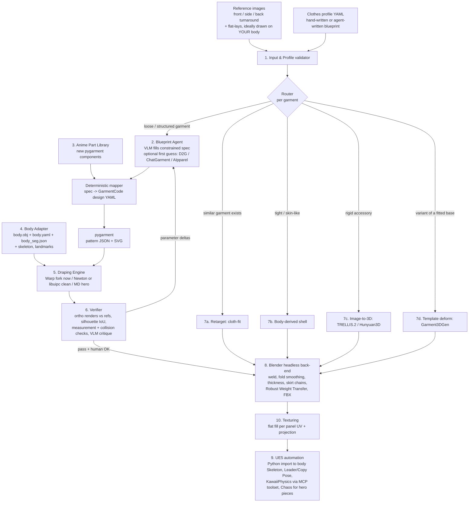

# Build Your Own Automatic Anime Tailor

**Yes: a solo creator can build an automatic, "Marvelous Designer-like" system that turns anime outfit turnarounds and a structured clothes profile into sewing patterns, drapes them on an existing custom anime body, and outputs rigged UE5 garments. Nobody has to train a model.** The approach that works is not to adopt one of the research "image-to-pattern" models. It is to assemble an agentic pipeline around **GarmentCode/pygarment** (MIT), the parametric sewing-pattern language that nearly every 2024–2026 pattern model already emits. In that pipeline, a frontier vision-language model such as Claude reads the turnaround and the profile and fills in a *constrained* GarmentCode parameter schema. Missing anime pieces (pleated skirts, sailor collars, capes, frills) come from a small library of new pygarment components that you write. GarmentCode's own headless Warp simulator drapes the result on your body, and that simulator needs only an OBJ, a ~26-value measurement file and a vertex-label file. A render-and-compare loop then checks the drape against the reference views before headless Blender and UE5 Python scripts make it game-ready. Every module has working open-source parts, and the training-free "VLM to GarmentCode to compare and revise" loop has been published twice (Design2GarmentCode, CVPR 2025; NGL-Prompter, 2026). The main risks are concrete. First, GarmentCode has **no pleat, sailor-collar, cape or frill components**, and its simulator does not fold pleats. Second, **no one has published accuracy numbers for VLM-driven pattern generation on anime art**, or for GarmentCode's tailoring rules at anime proportions. Third, the forked Warp simulator is licensed for **research and evaluation only**, so it must be swapped out (Newton, libuipc or Marvelous Designer) before anything ships commercially. Fourth, the open simulator's drape quality is below MD's. Realistic estimates for one developer working full-time: **an end-to-end MVP (one skirt and one shirt on your body, in UE5) in about 5 weeks, and a usable v1 with an anime part library, layering and alternative routes in about 5–6 months** (estimate). Expect the first version to produce strong drafts that sometimes still need a manual touch-up, not finished hero assets every time.

**How to read the flags.** "(snippet)" means the source page was blocked during research and the claim rests only on a search-engine summary. "(estimate)" marks engineering or schedule judgment with no published source. Line counts and timelines are always estimates. "(code-verified)" claims were read directly from repository code or configs.

## The verdict holds because every module already exists in some form

The feasibility case rests on three facts confirmed in code. First, **GarmentCode is a Python DSL whose garment programs emit JSON panel-and-stitch specs**. It is MIT-licensed, installs with `pip install pygarment`, and its v2 release added headless box-mesh generation, Warp simulation from the command line, and edge and panel labels in the JSON ([GarmentCode README](https://raw.githubusercontent.com/maria-korosteleva/GarmentCode/main/ReadMe.md); [CHANGELOG](https://raw.githubusercontent.com/maria-korosteleva/GarmentCode/main/CHANGELOG.md)). Second, its simulator treats the body as **just an OBJ plus a measurements YAML and a vertex-segmentation JSON**. Panels are placed analytically from about 26 body measurements, not from landmarks on the mesh, so a non-SMPL anime body works once those three files exist ([garment.py](https://github.com/maria-korosteleva/GarmentCode/blob/main/pygarment/meshgen/garment.py); [bodice.py](https://github.com/maria-korosteleva/GarmentCode/blob/main/assets/garment_programs/bodice.py); code-verified). The authors report **about 30 seconds per garment on an RTX 3090** ([arXiv 2405.17609](https://arxiv.org/html/2405.17609), snippet), which is fast enough for an iterative agent loop on your 24 GB card. Third, the output OBJ carries **UVs with one island per panel, aspect ratio preserved**, the property that makes MD garments easy to texture ([boxmeshgen.py](https://github.com/maria-korosteleva/GarmentCode/blob/main/pygarment/meshgen/boxmeshgen.py)).

The "agent writes the pattern" half is also validated. **Design2GarmentCode** (CVPR 2025, MIT code) uses GPT-4o as a multimodal understanding agent that extracts design features and synthesizes GarmentCode configs and programs. In its closed loop, "after the initial generation, the MMUA compares the generated design with the input and suggests modifications" ([project page source](https://raw.githubusercontent.com/style3d/Design2GarmentCode/master/index.html); [implementation](https://raw.githubusercontent.com/Style3D/design2garmentcode-impl/main/README.md)). **NGL-Prompter** (Feb 2026) reports a *fully training-free* pipeline: a frozen VLM emits discrete "Natural Garment Language" terms that a deterministic parser maps to GarmentCode parameters, and the authors claim it recovers multi-layer outfits ([arXiv](https://arxiv.org/abs/2602.20700), snippet). The GarmentGPT authors explain why this constrained design matters: VLMs "struggle with low-level regression of raw floating-point coordinates" ([OpenReview](https://openreview.net/forum?id=XzXKnazRBF), snippet). The design rule follows directly. The LLM chooses semantic parameters and components. Deterministic code produces the geometry.

The verdict is a conditional yes because of what nobody has demonstrated yet. No source reports a success rate for a frontier-LLM loop that authors GarmentCode, and **no source evaluates any pattern method on anime or manga art**. Even on realistic photos, ChatGarment's own README warns that it "may occasionally produce garments with incorrect lengths or widths" ([ChatGarment README](https://raw.githubusercontent.com/biansy000/ChatGarment/main/README.md)). GarmentCode's design space is Western ready-to-wear: shirts, fitted bodices, circle, godet, pencil, many-panel and tiered skirts, pants, hoods, lapels and turtlenecks ([default.yaml](https://raw.githubusercontent.com/maria-korosteleva/GarmentCode/main/assets/design_params/default.yaml)). A grep of `skirt_paneled.py` found no pleat construct ([skirt_paneled.py](https://raw.githubusercontent.com/maria-korosteleva/GarmentCode/main/assets/garment_programs/skirt_paneled.py)). Its placement formulas encode real-human tailoring, such as waist level = height − head length − waist line, so very large heads, short torsos or tiny waists may produce "plausible-but-odd" patterns. This is an untested risk, not a documented failure. The table below summarizes what could stop the project and how quickly each risk can be tested. The risk section later gives the full test plan.

| Main risk | Severity | Cheapest early test |
|---|---|---|
| GarmentCode programs misplace or misfit garments at anime proportions | High | Week 1: drape stock `Skirt2` and `Shirt` on your body |
| Pleats, sailor collars, capes and frills need new components; Warp does not fold pleats | High | Week 1–2: spike a pre-folded knife-pleat skirt |
| VLM reads of anime turnarounds are inaccurate (counts, lengths, collar shapes) | Medium–High | Phase 2: score 10–20 hand-labelled outfits |
| Warp fork is non-commercial and frozen on Warp 1.0.0-beta.6 | Medium now, high if commercial | Day 1 build; Newton port when needed |
| Open-sim drape quality and layering are below MD's | Medium | MVP side-by-side against one MD drape |

## Ten modules turn a profile into a playable outfit

The system is a pipeline of ten modules. A router sends each garment down the cheapest route that can produce it. Pattern-plus-simulation is the main road, and four alternative routes plug in for garments that don't need sewing. Every route ends in the same Blender back-end and UE5 importer.



### Module 1: Input and clothes profile, the single source of truth

The profile is a YAML file that you or an upstream agent writes. Its job is to hold everything the images cannot measure reliably: lengths, ease, fabric behavior, layering and colors. The images only decide topology and style. This split is the main defense against the documented failure mode of image-to-pattern models, which is getting lengths and widths wrong ([ChatGarment README](https://raw.githubusercontent.com/biansy000/ChatGarment/main/README.md)). Lengths are expressed **relative to body landmarks** ("to knee, minus 8 cm"), because GarmentCode itself sizes garments relative to a body-measurement YAML and raises `TotalLengthError` when a garment overflows floor length ([meta_garment.py](https://raw.githubusercontent.com/maria-korosteleva/GarmentCode/main/assets/garment_programs/meta_garment.py)). Each field can be **locked**, and a locked field is never changed by the revise loop. Every value also records its provenance (profile, image or agent), so the verifier knows which values it may tune. The schema below is a proposed design (estimate). The enumerations come from GarmentCode's existing component names plus the anime library in Module 3.

```yaml
profile_version: 1
units: cm
character: akari
body:
  mesh: bodies/akari_apose.fbx        # Body Adapter derives obj/yaml/seg from this
  measurement_overrides: { waist: 54.0 }
references:                            # orthographic, same camera rig as the verifier
  - { id: front, path: refs/front.png, view: front, camera: ortho_front, trust: high }
  - { id: side,  path: refs/side.png,  view: side,  camera: ortho_side,  trust: medium }
  - { id: back,  path: refs/back.png,  view: back,  camera: ortho_back,  trust: low }  # back is often invented
  - { id: skirt_flat, path: refs/skirt_flat.png, view: flat_lay, garment: skirt }
palette:                               # base + shadow tone per region (settei style)
  navy:  { base: "#1F2A44", shadow: "#141B2E" }
  white: { base: "#F4F4F0", shadow: "#C9CCD6" }
  red:   { base: "#C8102E", shadow: "#8E0B20" }
layering:
  order: [socks, blouse, skirt, ribbon]   # inner -> outer
  tuck: { blouse: skirt }                 # blouse hem tucked inside skirt waistband
outfit:
  - id: blouse
    type: top.blouse                   # enum: top.{shirt,blouse,fitted}, bottom.{skirt,pants}, outer.{jacket,coat,cape}, one_piece.dress, legwear, accessory
    route: auto                        # auto | pattern | retarget | body_derived | template | image3d | manual
    fit: { ease_bust: 6, ease_waist: 4 }
    measurements:
      length: { to: hip_line, offset: -3 }
      sleeve: { length_to: wrist, offset: 0, end_width: 22 }
    construction:
      neckline: { front: v_neck, depth: 14, back: circle }
      collar: { component: SailorCollar, back_depth: 22, front_tip: bust_line, stripes: 2, stripe_width: 0.8 }
      closure: pullover
      cuff: { type: CuffBand, width: 4 }
    details:
      - { type: ribbon_tie, at: collar_front_tip, width: 6, tail_length: 18, color: red, route: image3d }
    fabric: { preset: cotton_broadcloth, bending: stiff, stretch: low, density: light, thickness_mm: 1.0 }
    look: { fold_budget: low, anime_smoothing: 0.6 }
    colors: { body: white, collar: navy, collar_stripes: white, cuff: navy }
    ue_physics: { mode: leader_pose }
    locks: [measurements.length, construction.collar.back_depth]
  - id: skirt
    type: bottom.skirt
    route: pattern
    measurements:
      waist: { at: waist_line, ease: 2 }
      length: { to: knee, offset: -8 }
    construction:
      skirt: { component: PleatedSkirt, pleat_type: knife, pleat_count: 24, pleat_depth: 3.5, flare: 1.15 }
      waistband: { type: StraightWB, width: 3.5 }
    fabric: { preset: wool_gabardine, bending: very_stiff, pleat_memory: true }
    colors: { body: navy }
    ue_physics: { mode: kawaii_physics, chains: 12, bones_per_chain: 4 }
    locks: [measurements.length, construction.skirt.pleat_count]
```

The best references are turnarounds drawn **on your own body**. A zero-shot editor like Qwen-Image-Edit-2511 can "dress" orthographic renders of your A-posed body: it accepts up to three reference images and is tuned to reduce drift across edits ([RunComfy](https://www.runcomfy.com/comfyui-workflows/qwen-image-edit-2511-in-comfyui-precision-instruction-editing)), and community workflows already use it for consistent outfit changes ([NextDiffusion](https://www.nextdiffusion.ai/tutorials/consistent-outfit-changes-with-multi-qwen-image-edit-2511-in-comfyui)). Because those images share the body, pose and camera of your simulation renders, the verifier can compare silhouettes pixel for pixel. This is the single biggest accuracy lever in the design (estimate). **See-through** (SIGGRAPH 2026, Apache-2.0) splits an anime illustration into up to 23 inpainted semantic layers, including separate clothing layers, which yields per-garment masks and clean projection sources ([See-through README](https://raw.githubusercontent.com/shitagaki-lab/see-through/main/README.md)).

### Module 2: The Blueprint Agent fills a constrained schema and does not invent geometry

The Blueprint Agent is a multimodal LLM call wrapped in validation. Its input is every reference view, the profile with locked fields marked, the body measurements, and a **component registry**: every GarmentCode and anime-library component with its parameter names, types, enumerations and ranges. The registry is generated automatically from GarmentCode's design YAML, whose nested `{v, range, type, default_prob}` entries already declare `float`, `int`, `bool`, `select` and `select_null` types ([default.yaml](https://raw.githubusercontent.com/maria-korosteleva/GarmentCode/main/assets/design_params/default.yaml)). The output is an NGL-style spec. NGL-Prompter uses five blocks (meta, bodice, sleeve, skirt, pants) of discrete terms such as `neckline: v-neck` ([arXiv](https://arxiv.org/abs/2602.20700), snippet), and this design adds anime blocks for collars, capes and trims. Claude's API can enforce this shape through JSON-schema structured outputs or `strict` tool definitions, so malformed specs never reach the mapper. Following ChatGarment's two-step approach, in which the model first writes a text description and then generates GarmentCode ([ChatGarment README](https://raw.githubusercontent.com/biansy000/ChatGarment/main/README.md)), the agent first writes a garment-by-garment description with evidence from each view, then fills the spec. Each field carries an evidence string and a confidence score, which the verifier uses to decide what to revise first.

```json
{
  "garment_id": "skirt",
  "meta": { "upper": null, "wb": "StraightWB", "bottom": "PleatedSkirt" },
  "skirt": { "length_to": "knee", "length_offset_cm": -8, "pleat_type": "knife",
             "pleat_count": 24, "pleat_depth_cm": 3.5, "flare": 1.15 },
  "evidence": { "pleat_count": "12 pleats visible in front view; back view symmetric",
                "length_to": "profile (locked)" },
  "confidence": { "pleat_count": 0.6, "flare": 0.5 }
}
```

A deterministic **mapper** (plain Python) turns the spec into GarmentCode's design YAML. It converts body-relative lengths into GarmentCode's relative factors (for example `shirt.length` 0.5–3.5) using the body YAML, and it selects classes such as `meta.bottom ∈ {SkirtCircle, GodetSkirt, Skirt2, SkirtManyPanels, PencilSkirt, SkirtLevels, …}` or the new anime classes ([default.yaml](https://raw.githubusercontent.com/maria-korosteleva/GarmentCode/main/assets/design_params/default.yaml)). Running pygarment then acts as a free validator, because invalid totals raise errors before any simulation runs ([meta_garment.py](https://raw.githubusercontent.com/maria-korosteleva/GarmentCode/main/assets/garment_programs/meta_garment.py)).

The agent has a second, offline mode: **component authoring**. When a design needs a piece the registry lacks, the agent drafts a new pygarment `Panel`/`Component` subclass. GarmentCode makes this tractable because `MetaGarment` composes parts by class name and joins them through interfaces with `stitching_rules.append((interfaceA, interfaceB))`, so a new class only has to expose `interfaces['top'/'bottom']` ([meta_garment.py](https://raw.githubusercontent.com/maria-korosteleva/GarmentCode/main/assets/garment_programs/meta_garment.py)). New components enter the library only after you review them and they pass a test drape. The per-outfit loop never writes code. That boundary keeps runs reproducible and keeps LLM-written code out of the inner loop (estimate).

**Optional first-guess generators** can seed the spec. **Design2GarmentCode** (MIT) already ships a NiceGUI front end, GarmentCode, Warp simulation and a GPT-4o loop. Its understanding agent's `base_url` and `model` are configurable in `system.json`, and the only trained part is a Qwen2-VL-2B LoRA projector downloaded from Google Drive ([D2G implementation](https://raw.githubusercontent.com/Style3D/design2garmentcode-impl/main/README.md)). Cloning it is the fastest way to stand up Modules 2, 5 and 6 together. Pointing its endpoint at another provider is untested. **ChatGarment** (Apache-2.0 code, LLaVA-1.5-7B base) and **AIpparel** (LLaVA-1.5-7B, bf16) run locally. Their weights are about 14 GB in bf16, which should fit 24 GB, but the authors give no VRAM figures ([ChatGarment](https://raw.githubusercontent.com/biansy000/ChatGarment/main/README.md); [AIpparel config](https://raw.githubusercontent.com/georgeNakayama/AIpparel-Code/master/configs/aipparel.yaml)). Both models can only output components GarmentCode already has, both were trained on synthetic Western garments on SMPL-like bodies, and none of these models accepts multiple views natively. Treat them as a second opinion on the front view, not as the core. **SewingLDM** (Apache-2.0) is notable because it conditions on body shape and a sketch, and it drapes with GarmentCode's simulator ([SewingLDM README](https://raw.githubusercontent.com/shengqiliu1/SewingLDM/master/README.md)).

### Module 3: The anime part library is the code you must write

GarmentCode provides the right building blocks. Gathers and ruffles are a length-ratio factor on interfaces (`top_width = base_width * ruffles`). `distribute_horisontally` makes radial or horizontal copies of a panel. `cut_into_edge` makes darts. `CuffSkirt` and `connect_ruffle` already produce flared strips ([skirt_paneled.py](https://raw.githubusercontent.com/maria-korosteleva/GarmentCode/main/assets/garment_programs/skirt_paneled.py); [operators.py](https://raw.githubusercontent.com/maria-korosteleva/GarmentCode/main/pygarment/garmentcode/operators.py)). The anime library composes these into the pieces anime outfits depend on. The approaches below are design proposals and the line counts are estimates.

| New component | Construction approach | Hard part | Est. lines |
|---|---|---|---|
| `PleatedSkirt` (knife, box, accordion) | N face + underlay strip panels via `distribute_horisontally`; waist interface shortened by the pleat-take factor; panels pre-folded into a zigzag at placement, plus very high bending stiffness and waist attachment | Warp has no fold-line constraint, so pleats must be pre-folded geometry or they collapse into soft gathers | 300–500 |
| `SailorCollar` | Large flat square back flap + two tapered front panels stitched to a `VNeckHalf` neckline interface; stripes recorded as UV-space lines for texturing | Must lie flat on the back: stiff fabric, short attachment, optional pin to shoulder blades | 200–350 |
| `Cape` / `Capelet` | Circle-sector panels (reuse `SkirtCircle` math) attached at the neckline interface instead of the waist | Neck attachment label and collision filters (capes must collide with arms) | 150–250 |
| `FrillTrim` (generic) | Strip panel with ruffle > 1, attachable to any labelled edge (hem, cuff, collar, tier) | Interface matching on curved edges; self-collision of dense gathers | 150–300 |
| `PuffSleeve` | Existing sleeve with gathered cap and cuff via ruffle factors | Volume without a pressure force (sim lacks MD's Pressure) | 100–200 |
| `RibbonBow` | Procedural mesh or image-to-3D accessory with 1–2 tail panels; rigid-attached to a bone | Not really a sewing pattern; route to 7c | 100–200 |
| `StandCollar` (gakuran) | Variant of `Turtle` with stiff band | Minimal | 50–100 |

Each component also needs a small test harness that builds the component alone on your body, drapes it, and renders three views. Budget about one extra day per component for it (estimate). The pleat decision is the riskiest design call in the system. The research notes say plainly that pleats "are not natively folded by the Warp sim" and may require MD or Style3D downstream. Prototype the pre-folded approach in the first two weeks, compare it against MD's pleat tools, and accept that hero pleated skirts may go through the MD route.

### Module 4: The Body Adapter turns your anime body into GarmentCode's three files

GarmentCode loads `<bodies_path>/<body_name>.obj`, scales it ×100 (metres in the file, centimetres in the simulator), expects Y-up with feet at y=0, and reads a segmentation JSON of vertex indices for `body`, `left_arm`, `right_arm`, `left_leg`, `right_leg` and `face_internal`. That JSON path is currently hard-coded to `ggg_body_segmentation.json` ([sim_config.py](https://github.com/maria-korosteleva/GarmentCode/blob/main/pygarment/meshgen/sim_config.py); code-verified). These labels drive the collision filters (skirts ignore arm collisions) and the "body-part drag" that pulls intersecting panels toward their assigned limb ([panel_assignment.py](https://github.com/maria-korosteleva/NvidiaWarp-GarmentCode/blob/main/warp/collision/panel_assignment.py)). The body measurement set has about 26 keys, including height, head_l, bust, underbust, waist, hips, waist_line, hips_line, shoulder_w, shoulder_incl, armscye_depth, arm_length, arm_pose_angle (about 45°), neck_w, wrist, leg_circ, the back widths and crotch_hip_diff ([mean_all.yaml](https://github.com/maria-korosteleva/GarmentCode/blob/main/assets/bodies/mean_all.yaml)).

Three headless scripts produce these files with no machine learning. `prep_body.py` runs in Blender `-b`. It poses the body in A-pose and records `arm_pose_angle`, strips hair, eyes and inner-mouth faces, makes the mesh watertight, and exports `mybody.obj` in metres. `measure_body.py` takes vertical levels from bone heads (neck, upper-arm heads, thigh heads), finds the waist as the minimum torso circumference between chest and hips, and slices torso-only cross-sections for the circumferences. `segment_body.py` converts skin weights into the six vertex labels and patches the one `body_seg` path line. The research notes estimate the whole Body Adapter plus a drape wrapper and post-processing at **600–1,000 lines**. Two anime-specific precautions apply. Set the derived `_waist_level` key explicitly, since `_add_attachment_labels` checks for it first and the formula depends on `head_l` ([garment.py](https://github.com/maria-korosteleva/GarmentCode/blob/main/pygarment/meshgen/garment.py)). Clamp extreme values and log any clamping. The Adapter should also export the same body for the other engines: an OBJ in A-pose for MD, whose automatic arrangement points work only on T- or A-pose OBJ imports ([MD OBJ import](https://support.marvelousdesigner.com/hc/en-us/articles/47358223288601-3D-File-OBJ-Import-Export), snippet), and a skeleton edge mesh for cloth-fit (Module 7). The authors' `GarmentMeasurements` tool exists but may require its own template topology ([mbotsch/GarmentMeasurements](https://github.com/mbotsch/GarmentMeasurements)), so writing your own slicer is safer.

### Module 5: The Draping Engine uses the Warp fork now and keeps a license-clean path ready

The **primary engine is GarmentCode's Warp fork**. It merges stitched edge pairs into one connected "box mesh" before simulation (`collapse_stitch_vertices`), places panels from measurement-derived translations and rotations, and runs XPBD. The fork adds point-triangle and edge-edge self-collision, attachment constraints (a skirt fixed at the waist, collars), body-part drag, and a push-out body-collision constraint ([NvidiaWarp-GarmentCode](https://github.com/maria-korosteleva/NvidiaWarp-GarmentCode); code-verified). The defaults run at 60 fps with 10 substeps for up to 2,400 steps or 600 s, stop early on a static threshold, and fail a garment that exceeds `max_body_collisions: 35` or `max_self_collisions: 300` ([default_sim_props.yaml](https://github.com/maria-korosteleva/GarmentCode/blob/main/assets/Sim_props/default_sim_props.yaml)). Those thresholds are ready-made pass/fail signals for the agent. The default bending stiffness `garment_edge_ke: 1.0` is commented "Very soft fabric". An **anime sim preset** should raise bending by one to two orders of magnitude, raise `garment_tri_ke`, lower density, and enable `enable_body_smoothing`, which starts the drape on a Laplacian-smoothed body so cloth doesn't shrink-wrap small details. All of these knobs are inferences from the config, not tested settings.

**Layering** is the main gap. The simulator drapes one pattern spec, which can include an upper and a lower garment together, over one body. True shirt-under-jacket layering needs either one combined spec or sequential simulation, where each finished inner garment becomes an extra collider through a small `add_shape_mesh` patch in `garment.py`. The **license** is the second gap. The fork's LICENSE allows use "non-commercially," which it defines as "for research or evaluation purposes only," and it is frozen on Warp 1.0.0-beta.6, while upstream Warp moved to Apache-2.0 in 1.6.2 and removed `warp.sim` in 1.10.0 in favor of Newton ([fork LICENSE](https://github.com/maria-korosteleva/NvidiaWarp-GarmentCode/blob/main/LICENSE.md); [Warp CHANGELOG](https://github.com/NVIDIA/warp/blob/main/CHANGELOG.md)).

The **license-clean replacement is NVIDIA Newton** (Apache-2.0, a Linux Foundation project). Its `SolverStyle3D` is a projective-dynamics garment solver whose example takes **flat 2D panel coordinates as the rest shape**, anisotropic stretch and bend stiffness, and any avatar triangle mesh as a collider ([example_cloth_style3d.py](https://github.com/newton-physics/newton/blob/main/newton/examples/cloth/example_cloth_style3d.py); code-verified). You can feed it the BoxMesh vertices plus per-panel UVs. You would have to rewrite the waist and collar attachments and a push-out pre-phase, because Newton lacks GarmentCode's drag and attachment logic. The notes estimate this at "a few hundred extra lines" plus tuning. **libuipc** (Apache-2.0, GPU IPC, PyPI wheels, headless samples) is the refinement pass for guaranteed intersection-free layering, with one caveat: it requires a valid, non-penetrating starting state ([libuipc](https://github.com/spiriMirror/libuipc)). **Marvelous Designer** is the optional hero-quality engine. Its embedded Python API covers import, fabric, simulation and export, and two community MCP bridges let an agent drive it. However, it has no true headless mode. The ysk424 bridge makes MD's window unresponsive while it listens ([ysk424 bridge](https://github.com/ysk424/marvelous-designer-mcp)). The Laboon2501 bridge has 42 tools but is verified only on Windows, verifies only whole-edge sewing, and notes that arrangement is "not a verified world-space transform" ([Laboon2501 bridge](https://github.com/Laboon2501/MarvelousDesigner-MCP)). Moving GarmentCode JSON into MD needs a converter to DXF-AAMA plus API sewing calls, and none exists publicly.

| Engine | Role in this system | Why |
|---|---|---|
| GarmentCode Warp fork | Default for personal/portfolio work | Only engine that already does pattern JSON → placed, sewn, draped OBJ with panel UVs, headless |
| Newton Style3D | Commercial-safe default after port | Apache-2.0, 2D panel rest shapes, any mesh collider |
| libuipc | Layering cleanup pass | Intersection-free IPC, Apache-2.0 |
| Marvelous Designer + MCP | Hero pieces (pleats, complex layers) | Best drape; GUI-bound, Windows-verified bridges |
| Blender cloth | Fallback converter (300–500 lines est.) | Headless and free, CPU-only, weaker self-collision |
| Houdini Vellum, neural draping (HOOD, ContourCraft) | Not recommended | Vellum: license and learning cost. Neural: does not sew flat patterns, SMPL data required ([HOOD](https://github.com/Dolorousrtur/HOOD)) |

### Module 6: The Render-and-Compare Verifier closes the loop

The verifier is what turns "a pattern generator" into "automatic MD." After each drape, headless Blender renders front, side and back orthographic views with **exactly the reference cameras**, using flat unlit shading and per-garment ID colors. Four checks then run in order of cost. **Simulation health** comes free from GarmentCode's statistics: completion, body and self-collision counts, and the static stop. **Measurement checks** compare hem height, sleeve end and waist placement against the profile's locked values within a tolerance, for example ±1.5 cm (estimate). **Silhouette IoU** per view and per garment compares rendered masks against reference masks from See-through or SAM. The garment's numeric parameters (length, flare, width) are then tuned with small finite-difference steps, which is exactly how ChatGarment's optional post-process refines length and width against Grounding-SAM masks ([postprocess.md](https://raw.githubusercontent.com/biansy000/ChatGarment/main/docs/postprocess.md)). Last comes **VLM critique**. The agent sees each reference and render side by side, plus a structural checklist (missing components, wrong neckline, pleat count, collar shape, layer order), and returns *parameter deltas only*, never touching locked fields. Design2GarmentCode's second validation loop does the same thing ([project page source](https://raw.githubusercontent.com/style3d/Design2GarmentCode/master/index.html)).

The loop stops when all checks pass, for example IoU ≥ 0.85 in the trusted views and an empty checklist (thresholds are starting estimates). It also stops after a capped number of iterations, around five, because any loop that combines a VLM and a simulator can oscillate. Then it shows you a contact sheet for approval. One iteration costs roughly a 30 s drape, a few seconds of rendering and one VLM call, so a garment converges in minutes rather than hours (estimate based on the 30 s figure, which is a snippet). The back view gets low trust by default, because turnaround backs are usually invented by the artist or the AI.

### Module 7: Four alternative routes cover what sewing handles poorly

The router applies a simple decision rule that the research supports, though no head-to-head study has validated it. **Retargeting** handles any garment that resembles one you already own legally. **cloth-fit** (SIGGRAPH 2025, MIT, PolyFEM-based) retargets artist garments onto avatars with extreme proportions, with a guarantee of no intersections. Its examples include a `foxgirl_skirt`. It needs source and target skeleton edge meshes with identical joint order, ideally in the same pose ([cloth-fit README](https://raw.githubusercontent.com/Huangzizhou/cloth-fit/main/README.md)). The Body Adapter's skeleton export provides those meshes. **Body-derived shells** handle tight pieces such as leggings, bodysuits, tight sleeves and thigh-highs: duplicate the covered body faces, offset them, cut the openings and add Solidify, so the garment inherits the body's deformation-friendly topology. **Image-to-3D** handles rigid accessories: bows, shoes, belts, hats, emblems. **TRELLIS.2** (MIT, 4B parameters) explicitly supports open surfaces "e.g., clothing" and needs **at least 24 GB**, which puts your card at the minimum ([TRELLIS.2 README](https://raw.githubusercontent.com/microsoft/TRELLIS.2/main/README.md)). **Hunyuan3D-2.1** needs 10 GB for shape and 21 GB for texture, so on 24 GB the two stages must run separately ([Hunyuan3D-2.1 README](https://raw.githubusercontent.com/Tencent-Hunyuan/Hunyuan3D-2.1/main/README.md)). **Template deformation** produces variants of a base garment that is already fitted to your body. **Garment3DGen** pulls a clean template toward an image-to-3D target while keeping its topology and UVs, but its README warns that source and target must be "reasonably close," and "going from a skirt to a shirt won't work well" ([Garment3DGen README](https://raw.githubusercontent.com/nsarafianos/Garment3DGen/main/README.md)). Its CC BY-NC license confines it to personal work.

Two anime-specific generators deserve a watch, not a dependency. **StdGEN** (Apache-2.0 code, CVPR 2025) outputs separate body, hair and clothing layers from anime images, but it builds its own body ([StdGEN README](https://raw.githubusercontent.com/hyz317/StdGEN/main/README.md)). Its clothing layer is useful only as a target shell or blockout that is retargeted onto yours. Body-conditioned methods such as BAG and Tailor would fit "my body" directly, but no code was found for either ([BAG](https://bag-3d.github.io/), snippet; [Tailor](https://human-tailor.github.io/), snippet).

### Module 8: The headless Blender back-end makes every route game-ready

All routes converge on one `blender -b -P backend.py` script that does the same steps every time. It imports the `*_sim.obj` with panel UVs intact, merges by distance, and applies **anime fold smoothing**: Corrective or Laplacian smoothing with seams and hems pinned, on top of the stiff-bending simulation. *Guilty Gear Xrd*'s practice of editing vertex normals specifically to remove small shadows is the art-direction target ([BlenderNation](https://www.blendernation.com/2015/07/26/junya-c-motomura-behind-the-scenes-of-guilty-gear-xrd/)). The script then adds Solidify for thickness, or keeps a single-layer simulation mesh plus a thicker render mesh. Optional retopology runs through **QuadWild** (GPL-3.0, CLI, fewer than 0.5% failures on Thingi10K) or **AutoRemesher** (MIT), with UVs re-projected from the original ([QuadWild](https://raw.githubusercontent.com/nicopietroni/quadwild/main/README.md); [AutoRemesher](https://github.com/huxingyi/autoremesher)).

The pattern route has an underused advantage here. Because GarmentCode labels panels and edges and outputs a per-vertex panel segmentation, **the back-end knows exactly which vertices form the waist interface, the hem and each pleat panel** ([sim_config.py](https://github.com/maria-korosteleva/GarmentCode/blob/main/pygarment/meshgen/sim_config.py)). It can therefore place skirt bone chains down panel or pleat centerlines and paint weight gradients from the waist without any user edge selection. The research found no off-the-shelf tool that does this for arbitrary meshes, so this is new code (estimate). Skinning uses **Robust Weight Transfer**, the free Blender add-on based on Epic's SIGGRAPH Asia 2023 weight-inpainting method, which targets armpits, between the legs, and skirts ([add-on](https://raw.githubusercontent.com/sentfromspacevr/robust-weight-transfer/main/README.md); [reference code](https://raw.githubusercontent.com/rin-23/RobustSkinWeightsTransferCode/main/README.md)). The skirt chains are added to the **body** skeleton once, with standardized names, so every outfit skins to the same skeleton. The script finally exports a skeletal-mesh FBX in centimetres.

### Module 9: UE5 automation imports, attaches and tunes physics by script

UE's Python API imports skeletal meshes with `AssetImportTask` plus `FbxImportUI` (`import_as_skeletal`, `skeleton`, `physics_asset`), followed by `import_asset_tasks()` ([Epic community tutorial](https://forums.unrealengine.com/t/community-tutorial-automating-skeletal-mesh-imports-with-unreal-engines-python-api/2069661); [FbxImportUI](https://docs.unrealengine.com/4.26/en-US/PythonAPI/class/FbxImportUI.html)). A script imports each garment onto the body's Skeleton and writes one outfit Data Asset that lists the garment meshes and the body sections to hide. The character Blueprint attaches rigid followers with Leader Pose. Swinging garments either use Copy Pose From Mesh with their own Anim Blueprint, or all KawaiiPhysics nodes live in the body's Anim Blueprint, which works because the chain names are standardized. **KawaiiPhysics** (MIT, UE 5.3–5.8) provides skirt-specific BoneConstraint and SyncBone. Its UE 5.8 sample enables the experimental Unreal MCP plugin and bundles a `KawaiiPhysicsToolset` for adding and editing nodes, setting collision limits, running PIE penetration samplers, and "skirt check-and-tune helpers" ([KawaiiPhysics README](https://raw.githubusercontent.com/pafuhana1213/KawaiiPhysics/master/README.md)). That lets the same agent run a second, in-engine verify loop on motion clipping. **Chaos Cloth** is reserved for one or two hero pieces. MD 2025.2 can export USD with simulation data into a Chaos Cloth Dataflow on UE 5.6+, but not 5.5 ([MD USD workflow](https://support.marvelousdesigner.com/hc/en-us/articles/52699135975705-Marvelous-Designer-to-MetaHuman-USD-Garment-Integration-Workflow), snippet). Avoid UE's Outfit Asset resizing, which is editor-only and in 5.6 overwrites custom skinning with "a simple skin weight transfer from the body" ([Epic forum](https://forums.unrealengine.com/t/tutorial-chaos-cloth-outfit-asset-resizing-addendum/2647376), snippet).

### Module 10: Flat anime texturing comes almost free from panel UVs

Each UV island is one sewing panel, and the profile names a color per region. That makes the **base albedo a deterministic fill**: paint each panel's island with its palette color, and draw stripes, piping and hem bands as offsets of the panel's 2D edges in UV space. No AI is needed, and the result has the flat, shading-free look a cel shader wants (design inference). For prints, emblems and lace, **StableProjectorz** (AGPL-3.0 since January 2026) projects Stable Diffusion images onto existing UVs from up to six views ([StableProjectorz](https://www.stableprojectorz.com/), snippet). **Hunyuan3D-Paint-2.1** can texture any supplied mesh from a reference image in about 21 GB, but it outputs PBR maps with baked shading that must be flattened ([Hunyuan3D-2.1](https://raw.githubusercontent.com/Tencent-Hunyuan/Hunyuan3D-2.1/main/README.md)). See-through's per-garment layers make clean projection sources.

## About 9,000 new lines on top of mostly permissive parts

Most of the system is integration. The table separates what you can download from what you must write. Line counts are estimates. "Maturity" is a judgment based on documentation and code state, not on benchmarks.

| Component | Existing (repo · license · maturity) | You write | Est. lines / effort |
|---|---|---|---|
| Pattern language | [GarmentCode/pygarment](https://github.com/maria-korosteleva/GarmentCode) · MIT · research, v2.0.2, widely reused | — | — |
| Profile schema + validator | — | YAML schema, JSON-schema export, provenance and locks | 300–500 |
| Spec → design YAML mapper | — | Unit conversion, class selection, registry generator | 400–800 |
| Blueprint Agent | Claude API (structured outputs); [Design2GarmentCode](https://github.com/Style3D/design2garmentcode-impl) · MIT · research; [ChatGarment](https://github.com/biansy000/ChatGarment) · Apache-2.0 code; [AIpparel](https://github.com/georgeNakayama/AIpparel-Code) · no LICENSE file found; [SewingLDM](https://github.com/shengqiliu1/SewingLDM) · Apache-2.0 | Prompts, tool and schema definitions, multi-view packing, retries | 600–1,200 |
| Anime Part Library | pygarment operators | 6–7 components + test harnesses | 1,200–2,500 + ~1 day/component testing |
| Body Adapter | Blender, trimesh | prep_body, measure_body, segment_body | 400–700 |
| Draping (now) | [NvidiaWarp-GarmentCode](https://github.com/maria-korosteleva/NvidiaWarp-GarmentCode) · NVIDIA non-commercial · frozen beta | Drape wrapper, anime sim preset, layering collider patch | 200–400 |
| Draping (clean) | [Newton](https://github.com/newton-physics/newton) · Apache-2.0 · active; [libuipc](https://github.com/spiriMirror/libuipc) · Apache-2.0 | BoxMesh → Style3D port, attachments, push-out phase | 500–1,000 + tuning (optional) |
| Draping (hero) | MD 2026 · paid; [ysk424](https://github.com/ysk424/marvelous-designer-mcp) / [Laboon2501](https://github.com/Laboon2501/MarvelousDesigner-MCP) bridges · early | JSON→DXF-AAMA, API sewing, arrangement | 500–1,000 (optional) |
| Verifier | Blender renderer, SAM / [See-through](https://github.com/shitagaki-lab/see-through) · Apache-2.0 | Camera rig, masks, IoU, measurement checks, critique prompts, stop rules | 800–1,500 |
| Alt routes | [cloth-fit](https://github.com/Huangzizhou/cloth-fit) · MIT · research C++; [TRELLIS.2](https://github.com/microsoft/TRELLIS.2) · MIT; [Hunyuan3D-2.1](https://github.com/Tencent-Hunyuan/Hunyuan3D-2.1) · Tencent community; [Garment3DGen](https://github.com/nsarafianos/Garment3DGen) · CC BY-NC | Router, cloth-fit setup generator, body-derived shells, shell cleanup | 800–1,500 |
| Blender back-end | Blender; [Robust Weight Transfer](https://github.com/sentfromspacevr/robust-weight-transfer) · GPL-3.0; [QuadWild](https://github.com/nicopietroni/quadwild) · GPL-3.0; [SKBoneGen](https://github.com/ek1den2/SKBoneGen) · MIT | Weld, smoothing, Solidify, label-driven chains, weights, FBX | 1,000–2,000 |
| UE5 automation | UE Python API; [KawaiiPhysics](https://github.com/pafuhana1213/KawaiiPhysics) · MIT · production-used | Import script, Data Asset writer, KawaiiPhysics presets / MCP calls | 400–800 |
| Texturing | StableProjectorz · AGPL-3.0; Hunyuan3D-Paint | Panel-fill and stripe generator | 200–400 |
| **Total core (excluding optional engines)** | | | **≈6,300–12,300; plan on ~9,000** |

One license fact conflicts across sources. Earlier research listed AIpparel as MIT, while the latest direct check found **no LICENSE file at the repo root** ([AIpparel README](https://raw.githubusercontent.com/georgeNakayama/AIpparel-Code/master/README.md)). Treat it as all-rights-reserved until a license appears.

## A five-week MVP, then capability in measured phases

The plan front-loads the two make-or-break tests (anime proportions and pleats) and reaches a runnable end-to-end path before adding any AI. Durations assume one developer working full-time; at part-time hours (around 15 h/week), multiply by roughly 2.5. Every figure is an estimate.

| Phase | Weeks (cumulative) | Deliverable | Milestone / exit test |
|---|---|---|---|
| 0. Feasibility spikes | 1–2 (2) | GarmentCode + Warp fork built; Body Adapter v0; stock `Skirt2` and `Shirt` from `default.yaml` draped on your body; pre-folded pleat spike | Drapes finish under the 35/300 collision thresholds; waist and armholes land correctly; pleat spike holds folds or the MD fallback is chosen |
| 1. MVP end-to-end | 3–5 (5) | Hand-written profile (skirt + shirt) → mapper → drape → minimal Blender back-end (weld, smooth, Solidify, label-driven skirt chains, RWT) → FBX → UE import with Leader Pose and manual KawaiiPhysics | Walk and run cycle in UE 5.8 with **zero manual mesh edits** |
| 2. Blueprint Agent + Verifier | 6–9 (9) | VLM spec filling, ortho render rig, masks, IoU, measurement checks, critique loop; evaluation set of 10–20 hand-labelled anime outfits | Per-field accuracy measured; loop converges within 5 iterations on most stock-component outfits |
| 3. Anime Part Library | 10–15 (15) | PleatedSkirt, SailorCollar, Cape, FrillTrim, PuffSleeve, StandCollar, RibbonBow routing | A full serafuku from turnaround to UE without hand edits |
| 4. Layering + alt routes | 16–20 (20) | Sequential layering + optional libuipc pass; body-derived route; image-to-3D accessories; cloth-fit retargeting; optional Garment3DGen variants | Three-layer outfit (blouse tucked into skirt, jacket over it) with no visible poke-through in motion |
| 5. Texturing + UE polish | 21–23 (23) | Panel-fill albedo, projection for prints, KawaiiPhysics MCP tuning, outfit Data Assets and switching | One command takes profile + images → playable outfit in UE |
| 6. Optional engines | +3–8 | Newton port (commercial-safe); MD hero bridge | Same garments drape in Newton within visual tolerance of the Warp fork |

This schedule implies a trade-off worth stating plainly. A skilled manual workflow (MD or Blender plus weight transfer plus KawaiiPhysics) takes roughly 1–3 days per outfit once the one-time systems exist (estimate). A roughly 23-week build therefore pays back in time only across dozens of outfits, or if the system itself is the portfolio piece. A strong hedge is to stop after Phase 2 or 3. At that point the system already produces a correctly sized, sewn draft with panel UVs and skirt chains, which turns the manual pass from building a garment into touching one up.

## Licensing: portfolio use is workable, commercial use needs three swaps

For personal and portfolio work, almost everything is usable. The one gray area is the simulator fork. Its license restricts use to "research or evaluation purposes only," and whether a public portfolio counts as "evaluation" is a judgment call (or a question for a lawyer), not a settled point ([fork LICENSE](https://github.com/maria-korosteleva/NvidiaWarp-GarmentCode/blob/main/LICENSE.md)). If outputs ever ship in a sold game or a paid asset, the table lists what must change.

| Component | License | Personal / portfolio | If commercial, swap to |
|---|---|---|---|
| GarmentCode/pygarment | MIT | ✓ | Keep |
| NvidiaWarp-GarmentCode | NVIDIA Source Code License, non-commercial | Gray area | **Newton** (Apache-2.0), **libuipc** (Apache-2.0), or MD Personal |
| Marvelous Designer | Paid; Personal plan $39/month or $280/year allows commercial use for eligible sole proprietors ([MD License Plan](https://support.marvelousdesigner.com/hc/en-us/articles/47358258006425-License-Plan), snippet) | ✓ | Keep (verify EULA on scripting) |
| Garment3DGen, GarmentDreamer | CC BY-NC 4.0 ([Garment3DGen](https://github.com/nsarafianos/Garment3DGen); [GarmentDreamer](https://github.com/boqian-li/GarmentDreamer)) | ✓ | Drop; use cloth-fit (MIT) or your own deformation |
| GarmageNet | CC BY-NC-ND 4.0 ([license](https://github.com/Style3D/garmagenet-impl)) | Avoid modifying | Drop |
| Hunyuan3D-2.1 / Part | Tencent community license; not applicable in the EU, UK and South Korea ([Hunyuan3D-Part](https://github.com/Tencent-Hunyuan/Hunyuan3D-Part)) | ✓ outside those regions | TRELLIS.2 (MIT) |
| AIpparel, Sewformer, DressCode | No root LICENSE found | First-guess only, don't ship | ChatGarment (Apache-2.0 code) or none |
| ChatGarment weights; post-process | LLaVA/Vicuna base implies Llama 2 terms (inferred); SMPL/TokenHMR typically non-commercial | ✓ | Skip post-process; your own IoU tuner |
| Design2GarmentCode | MIT; Qwen2-VL-2B Apache-2.0; GPT-4o per API terms | ✓ | Keep |
| StableProjectorz, QuadWild, Robust Weight Transfer add-on | AGPL-3.0 / GPL-3.0 | ✓ | Fine to use; obligations apply only if you redistribute the tools |
| TRELLIS.2, StdGEN code, cloth-fit, KawaiiPhysics, SKBoneGen, AutoRemesher, Newton, libuipc | MIT / Apache-2.0 | ✓ | Keep (check StdGEN weight license on Hugging Face, unverified) |

Two more points matter for commercial use. Your custom body sidesteps the SMPL licensing that encumbers most garment research. And the outfit *designs* belong to the manga's rights holder, which is separate from every software license above.

## Risks to kill in the first two weeks

The plan works because the riskiest assumptions can be tested cheaply and early. Each row names a concrete test and a fallback.

| Risk / unknown | Evidence | Early test | Fallback |
|---|---|---|---|
| GarmentCode placement and fit at anime proportions | Placement uses `height − head_l − …` and fixed z-offsets ([bodice.py](https://github.com/maria-korosteleva/GarmentCode/blob/main/assets/garment_programs/bodice.py)); untested on non-human proportions | Phase 0: drape 4–5 stock garments; overlay renders on body; check waist level and armscye | Set `_waist_level`, clamp measurements, patch program formulas; MD for misfits |
| Custom body labels and body-part drag misbehave | Drag and collision filters rely on vertex labels ([panel_assignment.py](https://github.com/maria-korosteleva/NvidiaWarp-GarmentCode/blob/main/warp/collision/panel_assignment.py)) | Generate seg JSON from skin weights; watch collision counts | Hand-fix labels; inflate collision thickness |
| Pleats collapse in Warp | No pleat construct, no fold constraints | Phase 0 pleat spike vs MD pleat tools | MD route for pleated hero skirts; zigzag-modelled pleats + bone chains |
| VLM accuracy on anime art | No benchmark on stylized inputs exists | Phase 2 labelled set; compare Claude vs D2G vs ChatGarment per field | Profile locks more fields; human edits the YAML in GarmentCode's NiceGUI configurator |
| Warp fork build rot | Requires manual build, Python 3.9, CUDA ≥11.5, Warp 1.0.0-beta.6 ([Installation.md](https://raw.githubusercontent.com/maria-korosteleva/GarmentCode/main/docs/Installation.md)) | Day 1 build on your GPU and driver, inside a container | Start the Newton port early |
| Layering interpenetration | Sim drapes one spec over one body | Phase 4 three-layer test | Sequential colliders + libuipc pass; outer layer inflated in back-end |
| Agent loop oscillates or costs too much | Not studied anywhere | Log every iteration; cap at 5; lock profile fields | Human approval gate after iteration 2 |
| VRAM contention on 24 GB | TRELLIS.2 needs ≥24 GB; Hunyuan shape + paint 29 GB total | Run one model at a time with explicit unload | Cloud VLM for agent calls; staged generation |
| MD automation fragility | GUI freezes, serial calls, whole-edge sewing only | Phase 6 one-garment round trip | Manual MD session for hero pieces |
| Bone chains and weights on dense triangle meshes | No auto chain tool found; Chaos and KawaiiPhysics behavior on raw sim density untested | MVP: measure triangle count and UE deformation quality | Per-panel quad meshing before simulation; QuadWild retopology |

## Claims that rest on snippets or remain unverified

Several load-bearing claims come only from search summaries, because arXiv, Hugging Face and several vendor sites were blocked during research. Treat them as probable and recheck before relying on them. These include: the **30 s per garment on an RTX 3090** figure; everything about **NGL-Prompter, PatternGSL, DressWild, GarmentWeaver, Image2Garment, Dress-1-to-3, TailorCoPilot and GarmentGPT** (none has confirmed code or weights); MD's API function names, the **absence of a headless mode**, MD on Linux, pricing and licensing, automatic arrangement points requiring T- or A-pose, and the **MD USD → Chaos Cloth path on UE 5.6+**; Blender's exact sewing-spring property names; Houdini Indie and Engine licensing for batch work; **Chaos Cloth Dataflow being production-ready in UE 5.8**, Outfit Asset resizing limits, and Mutable Mesh Reshape failing on simulated sections; StableProjectorz's AGPL relicensing; BAG, Tailor and Dress Anyone; the claim that **MD 2025.1's AI Pattern Drafter is limited to T-shirts** ([CG Channel](https://www.cgchannel.com/2025/08/clo-virtual-fashion-releases-marvelous-designer-2025-1/), snippet); and Style3D's "70%" prototyping-time claim, which is vendor marketing. Also unverified: Hugging Face weight licenses for Sewformer, DressCode, AIpparel, SewingLDM and StdGEN; whether `GarmentMeasurements` works on arbitrary topology; whether D2G's agent works against non-OpenAI endpoints; and VRAM and runtime for ChatGarment, AIpparel, Garment3DGen and cloth-fit. No source measured any of the success rates, thresholds or schedules in this report. They are engineering estimates meant to be replaced by your own Phase 0 and Phase 2 measurements.

## Conclusion

The key insight is that "automatic Marvelous Designer" stopped being a modeling problem once a shared, executable pattern language existed. The research models matter less as generators than as proof that GarmentCode is a stable target an LLM can write to. With that target, the hard parts move to places a solo developer controls. You write a handful of anime components, you sanitize one body, and the reference images are drawn on your own body so the verifier can compare like with like. Those are weeks of deterministic engineering, not open research. The genuinely open questions (VLM accuracy on stylized art, pleat folding, extreme proportions) can all be answered in the first two to nine weeks, before most of the effort is spent.

The second implication concerns where the value lands. The simulator is the most replaceable part of the stack (Warp fork today, Newton or MD tomorrow). The assets that compound are the profile schema, the anime part library and the verifier's labelled test set. Those three pieces turn every future outfit into a configuration change rather than a modeling job, and they survive engine swaps, license changes and the next wave of pattern models. If an anime-trained pattern model with released weights appears in 2027, it plugs into Module 2 as one more first-guess generator instead of making the system obsolete.
